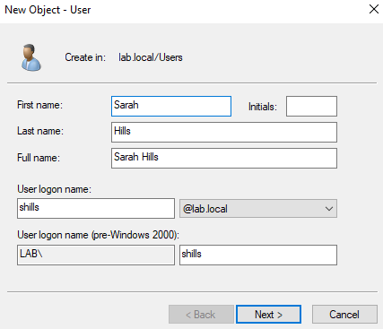
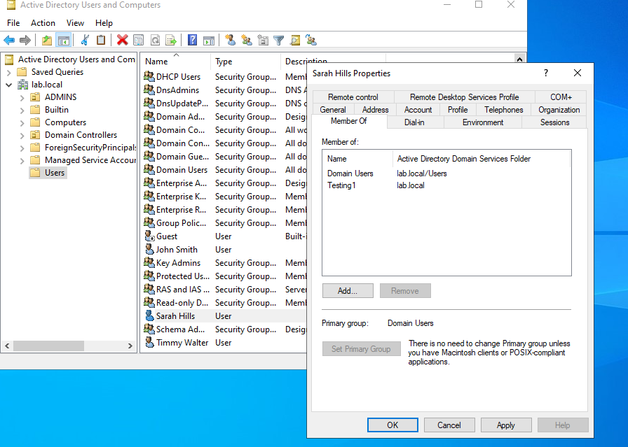
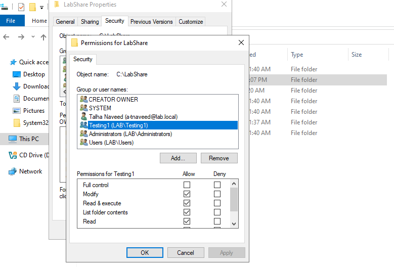
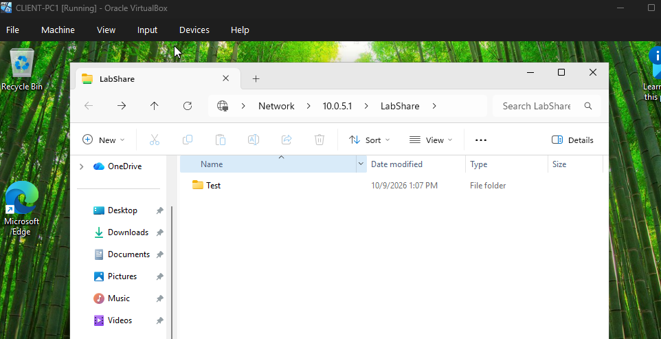
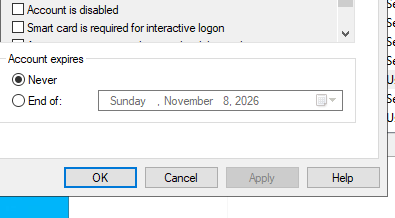
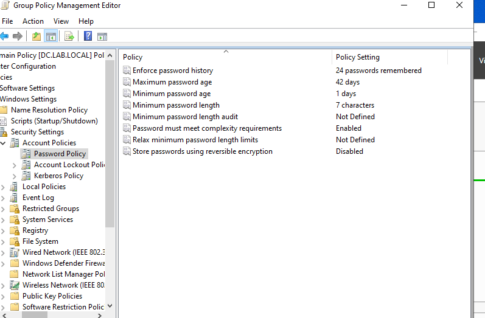
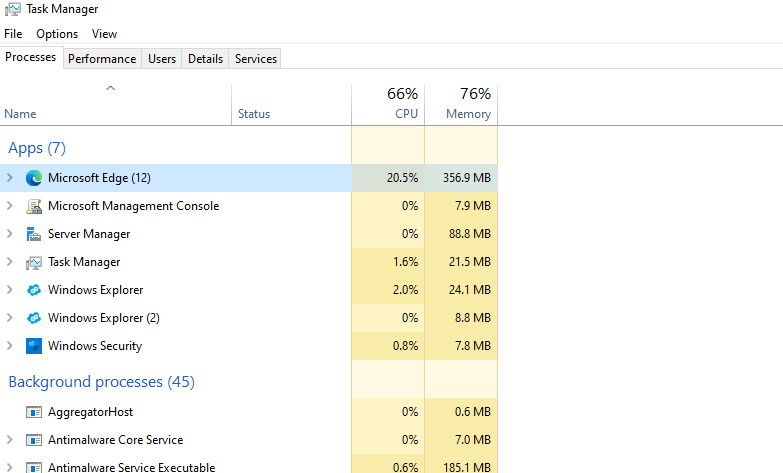
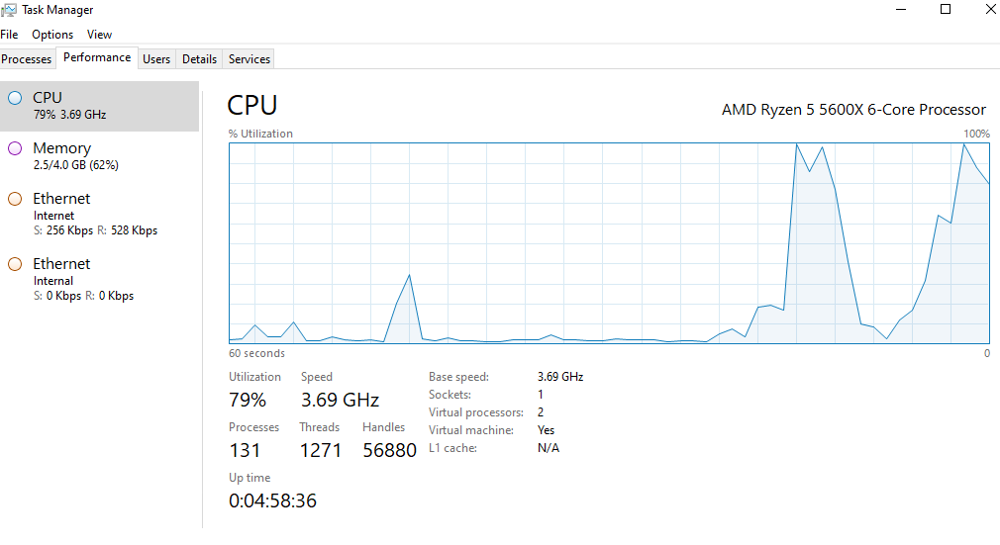
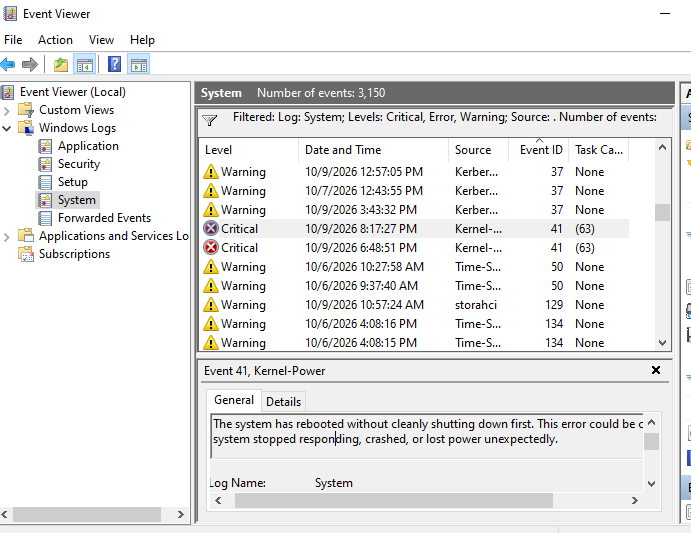

| Ticket ID      | Category                  | Scenario/Task | Outcome | Tools & Skills |
| :--- | :--- | :--- | :--- | :--- |
| **TKT-001**     | Network Diagnostics  | Investigate network configuration and connectivity.  | Inspected IP configuration, renewed the DHCP lease, flushed the DNS cache and tested connectivity.   | Command Prompt, IP configuration, DNS, ping |
| **TKT-002**     | Active Directory Administration| Create a test domain user and assign appropriate group membership. | Created a test user and configured its security group membership. | Active Directory, user accounts, security groups |
| **TKT-003**     | File and Folder Permissions | Configure folder access for an Active Directory security group. | Configured NTFS permissions and tested folder access from a Windows client. |  Windows Server, NTFS permissions, security groups, file sharing |
| **TKT-004**     | Account Troubleshooting | Investigate a simulated domain account sign-in issue. | Identified a disabled test account and re-enabled it. | Active Directory, account troubleshooting |
| **TKT-005**     | Group Policy Management | Inspect domain password policy settings. | Reviewed password policy configuration and identified a potential security improvement | Group Policy, GPMC, Windows administration |
| **TKT-006**     | Windows Troubleshooting | Investigate Windows performance using built-in tools. | Monitored CPU and memory usage and inspected running processes under a simulated workload. | Task Manager, process monitoring, performance checks | 
| **TKT-007**     | Event Log Investigation | Investigate Windows events related to system errors. | Examined a critical system event and considered a possible cause in a VirtualBox lab. | Event Viewer, Windows Logs, error investigation |

  
## TKT-001: Network Diagnostics

Used Windows command-line tools to inspect network configuration, practise DHCP lease renewal, clear the DNS resolver cache and test connectivity.  
 

  

## TKT-002: Active Directory Administration

Created a test domain user and configured its security group membership in Active Directory.

  

## TKT-003: File and Folder Permissions

Configured NTFS permissions to grant an Active Directory security group appropriate access to a folder.

  

## TKT-004: Account Troubleshooting

Investigated simulated domain sign-in issue by disabling and re-enabling a test user account in Active Directory.

  

## TKT-005 Group Policy Management

Inspected domain Group Policy settings and reviewing password policy configuration in a Windows Server lab

  

## TKT-006: Windows Troubleshooting

Simulated a Windows performance investigation by opening multiple browser tabs and monitoring CPU and memory utilisation in Task Manager.

  

## TKT-007: Event Log Investigation

Investigated a critical Windows system event relating to an unexpected shutdown and considered the possible cause in a VirtualBox lab environment.

