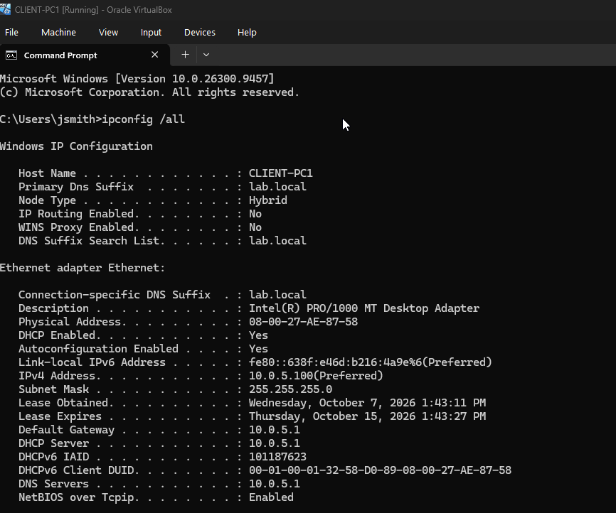
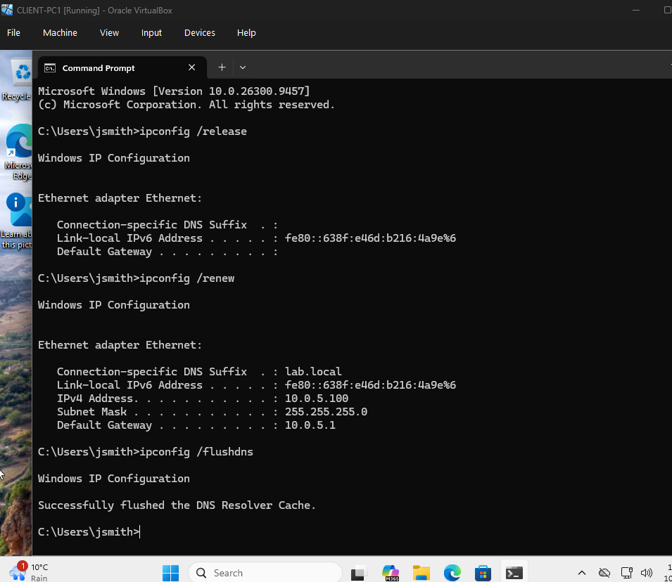
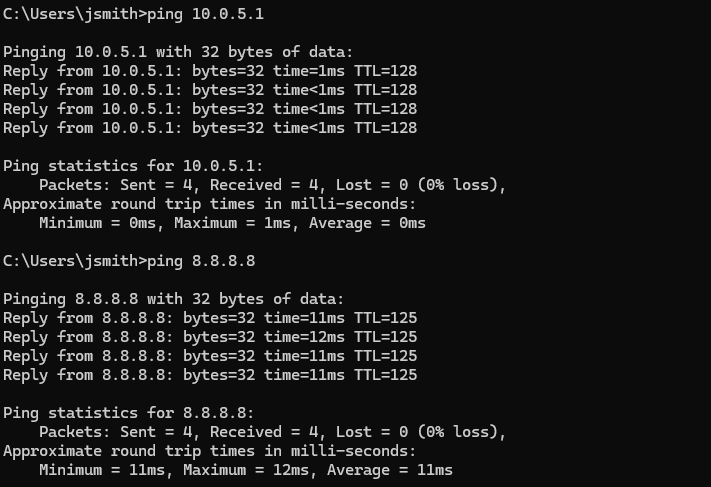

| Ticket ID      | Category                  | Scenario/Task | Outcome | Tools & Skills |
| :--- | :--- | :--- | :--- | :--- |
| **TKT-001**     | Network Diagnostics  | Practise investigating network configuration and connectivity.  | Inspected IP configuration and practised network connectivity and DNS checks.   | Command Prompt, IP configuration, DNS, ping |
| **TKT-002**     | Active Directory Administration| Create a test domain user and assign appropriate group membership. | Created a test user, assigned group membership and verified account properties. | Active Directory, user accounts, security groups |
| **TKT-003**     | File and Folder Permissions | Configure access to a shared folder for an Active Directory security group. | Configured and checked NTFS permissions for the security group. |  Windows Server, NTFS permissions, shared folders |
| **TKT-004**     | Account Troubleshooting | Practise investigating a domain account sign-in problem. | Inspected account status and relevant account settings. | Active Directory, account troubleshooting |
| **TKT-005**     | Group Policy Management | Practise checking why a required desktop setting may not be applied. | Inspected Group Policy configuration and checked policy application. | Group Policy, GPMC, Windows administration |
| **TKT-006**     | Windows Troubleshooting | Investigate Windows system performance using built-in tools. | Inspected resource usage and running processes in Task Manager. | Task Manager, process monitoring, performance checks | 
| **TKT-007**     | Event Log Investigation | Practise investigating Windows events related to system errors. | Reviewed relevant Windows event logs and examined event details. | Event Viewer, Windows Logs, error investigation |

  
## TKT-001: Network Diagnostics

1. **Initial Initial Network Configuration Check**
   Used `ipconfig /all` to inspect the network adapter configuration, IP address, default gateway and DNS settings.
   
  

  

2. **DHCP Lease Renewal and DNS Cache**
   Used `ipconfig /release`, `ipconfig /renew`  to obtain a fresh DHCP lease, and wipe the local DNS cache, followed by `ipconfig /flushdns` to clear the local DNS resolver cache.

  

3. **Network Connectivity Testing**
   Used ping to test connectivity to the default gateway and an external IP address.

  

## TKT-002: Active Directory Administration

Investigation Steps

1. **Create a Test Domain User**
Opened Active Directory Users and Computers and created a test domain user in the appropriate organisational unit (OU).

2. **Assign Security Group Membership**
Added the test user to the appropriate security group and checked the group membership.

3. **Verify Account Properties**
Reviewed the account properties to confirm the user account and group membership were configured as intended.

